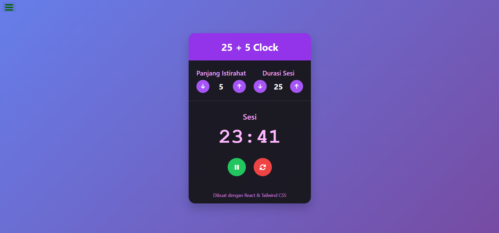

# ⏱️ 25 + 5 Clock (Pomodoro Clock)

Aplikasi **Clock** interaktif yang dibangun dengan **React (via CDN)** dan **TailwindCSS**.  
Proyek ini merupakan implementasi dari [FreeCodeCamp Frontend Libraries Project](https://www.freecodecamp.org/learn/front-end-development-libraries/#front-end-development-libraries-projects).

✨ Fitur:
- Timer Pomodoro klasik: sesi kerja 25 menit + istirahat 5 menit (dapat diubah).
- Tombol **Start / Pause** dan **Reset**.
- Atur durasi sesi dan istirahat secara interaktif.
- Audio alert saat sesi/istirahat selesai.
- Desain modern, interaktif, dan responsif dengan TailwindCSS.
- Mendukung keyboard dan mouse.

---

## 🚀 Demo
👉 [Lihat Live Demo di GitHub Pages](https://ddekaee.github.io/clock/)  

---

## 🛠️ Teknologi yang digunakan
- [React 18](https://react.dev/) via CDN (tanpa build tools)
- [TailwindCSS](https://tailwindcss.com/) untuk styling modern
- [Font Awesome](https://fontawesome.com/) untuk ikon tombol
- [FreeCodeCamp Test Suite](https://cdn.freecodecamp.org/testable-projects-fcc/v1/bundle.js)

---

## 📸 Preview


---

## 📦 Cara Menjalankan
1. Clone repo ini:
   ```bash
   git clone https://github.com/ddekaee/clock.git
2. Buka file index.html di browser.

3. Selesai ✅, Pomodoro Clock siap digunakan.
